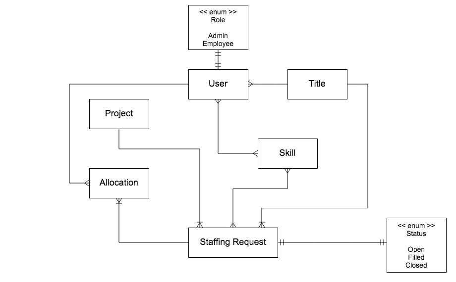

# Staffing API

This API goes with the [Angular.js exercises found here](https://github.com/ga-wdi-boston/wdi_7_js_angular).



## Endpoints & Routes

```ruby
staffing_requests GET    /staffing_requests(.:format)     staffing_requests#index
                  POST   /staffing_requests(.:format)     staffing_requests#create
 staffing_request GET    /staffing_requests/:id(.:format) staffing_requests#show
                  PATCH  /staffing_requests/:id(.:format) staffing_requests#update
                  PUT    /staffing_requests/:id(.:format) staffing_requests#update
                  DELETE /staffing_requests/:id(.:format) staffing_requests#destroy
      allocations GET    /allocations(.:format)           allocations#index
                  POST   /allocations(.:format)           allocations#create
       allocation GET    /allocations/:id(.:format)       allocations#show
                  PATCH  /allocations/:id(.:format)       allocations#update
                  PUT    /allocations/:id(.:format)       allocations#update
                  DELETE /allocations/:id(.:format)       allocations#destroy
         projects GET    /projects(.:format)              projects#index
                  POST   /projects(.:format)              projects#create
          project GET    /projects/:id(.:format)          projects#show
                  PATCH  /projects/:id(.:format)          projects#update
                  PUT    /projects/:id(.:format)          projects#update
                  DELETE /projects/:id(.:format)          projects#destroy
           skills GET    /skills(.:format)                skills#index
                  POST   /skills(.:format)                skills#create
            skill GET    /skills/:id(.:format)            skills#show
                  PATCH  /skills/:id(.:format)            skills#update
                  PUT    /skills/:id(.:format)            skills#update
                  DELETE /skills/:id(.:format)            skills#destroy
            users GET    /users(.:format)                 users#index
                  POST   /users(.:format)                 users#create
             user GET    /users/:id(.:format)             users#show
                  PATCH  /users/:id(.:format)             users#update
                  PUT    /users/:id(.:format)             users#update
                  DELETE /users/:id(.:format)             users#destroy
           titles GET    /titles(.:format)                titles#index
                  POST   /titles(.:format)                titles#create
            title GET    /titles/:id(.:format)            titles#show
                  PATCH  /titles/:id(.:format)            titles#update
                  PUT    /titles/:id(.:format)            titles#update
                  DELETE /titles/:id(.:format)            titles#destroy
```
